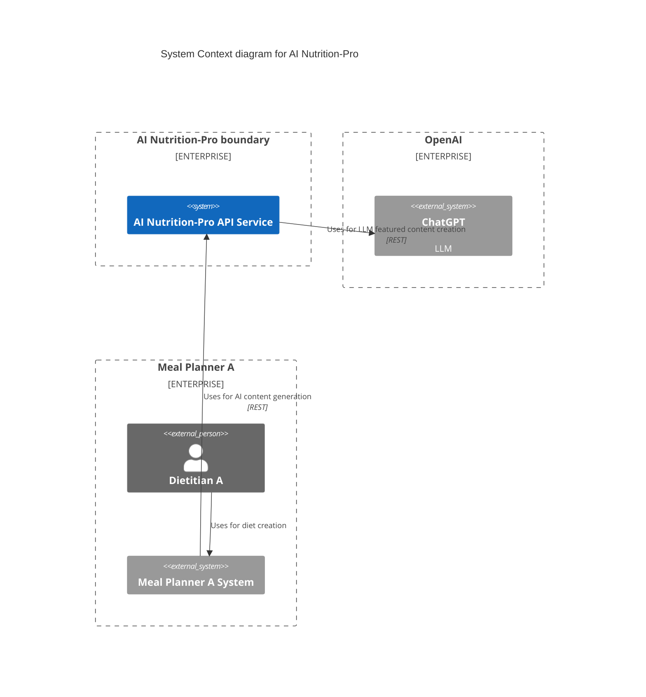
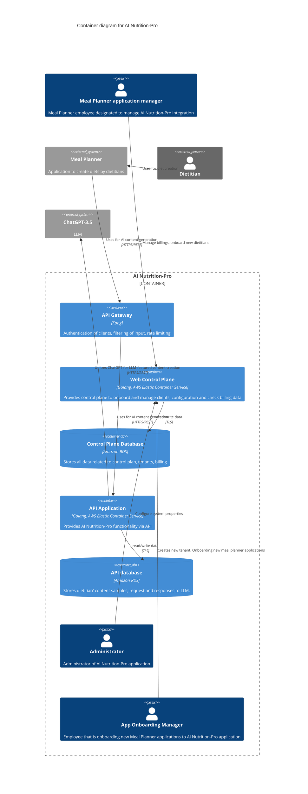
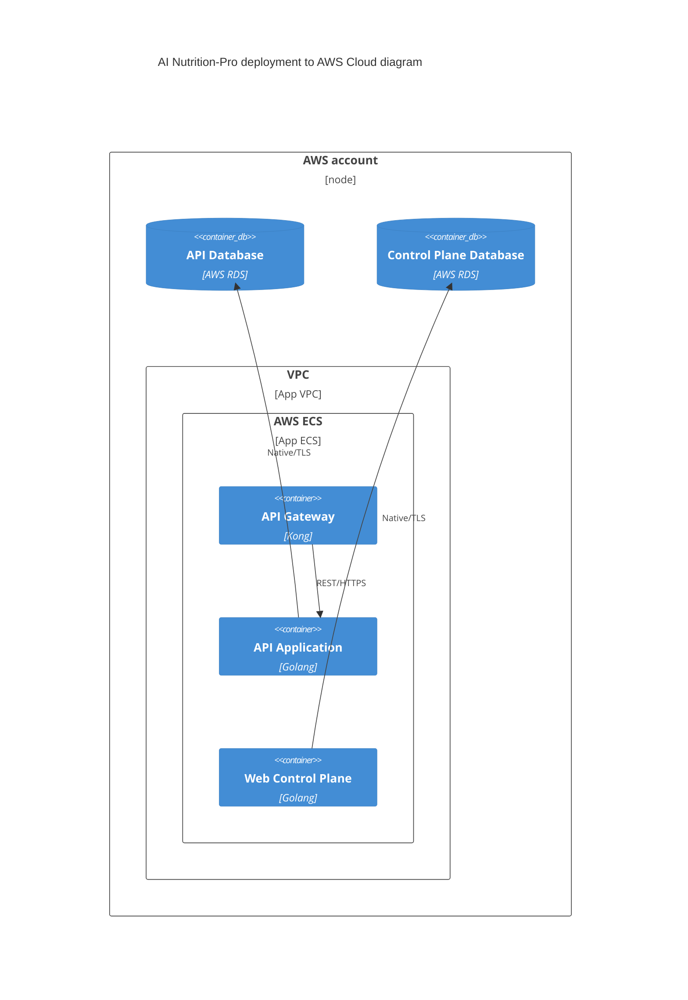

# Architecture

This document outlines the architecture of the AI Nutrition-Pro application, including system context, containers, and deployment views. The architecture is depicted using C4 diagrams for enhanced clarity..

## System Context diagram

- AI Nutrition-Pro is API backend application that uses OpenAI ChatGPT as LLM solution. It connects to OpenAI server using REST.
- Meal Planner A is one of many Meal Planner applications that can be integrated with AI Nutrition-Pro. It connects to AI Nutrition-Pro using REST.
- Dietitian A uses Meal Planner A for making diets. For example, dietitian can generate new diet introductions based on existing ones. LLMs can create this content following personal style of dietitian.

## Containers Context diagram

### External systems and persons

| Name | Type | Description | Responsibilities |
| --- | --- | --- | --- |
| Meal Planner application | External system, web application | One of many Meal Planner applications that can be integrated with AI Nutrition-Pro. It connects to AI Nutrition-Pro using REST and HTTPS. | - uploads samples of dietitians' content to AI Nutrition-Pro   - fetches AI generated results, e.g. diet introduction, from AI Nutrition-Pro | 
| Dietitian | External person | It's a customer of Meal Planner application. It's using Meal Planner to create diets for patients. It will see AI generated content directly in Meal Planner. | - creates diets   - consents to AI processing of data |
|  ChatGPT-3.5 | External system, API | It's OpenAI product, an LLM solution | It will be used to generate content based on provided samples. |
 
### AI Nutrition-Pro container context systems and persons

| Name | Type | Description | Responsibilities |
| --- | --- | --- | --- |
| Web Control Plane | Internal system, Web application | It's written using Golang and deployed as Docker container into AWS Elastic Container Service. It uses Control Plane Database to store data. It's used in 3 roles: Administrator, App Onboarding Manager, and Meal Planner application manager. | Provide control plane to onboard and manage clients, configuration and check billing data |
| Control Plane Database | Internal database, Amazon RDS instance | Database | storing data for Web Control Plane |
| API Gateway | Internal system, API Gateway | Kong API Gateway | - authentication   - rate limiting   - filtering of input |
| API Application | Internal system, API application | It's written using Golang and deployed as Docker container into AWS Elastic Container Service | Provides AI Nutrition-Pro functionality via API. |
| API database | Internal database, Amazon RDS instance | Stored data: samples of dietitians' content, requests, and responses to LLM. | Storing data for API Application |
| Administrator | Internal Person | Administrator of AI Nutrition-Pro application. | - manage server configuration   - resolve problems   |
| App Onboarding Manager | Internal Person | Employee that is onboarding new Meal Planner applications to AI Nutrition-Pro application. | - manage configuration of integrated Meal Planner application |
| Meal Planner application manager | Internal Person | Employee of Meal Planner | Manages AI Nutrition-Pro integration, e.g. configuration, api keys, billings. |

## Deployment diagram

For deployment, we will use Amazon AWS Cloud.

- API Gateway - deployed into AWS ECS service and into App VPC. It's Kong. Accessing API Application using REST/HTTPS protocol.
- API Application - deployed as Docker container into AWS ECS service and into App VPC. It's application created in Golang. Accessing API Database using Native/TLS protocol.
- Web Control Plane - deployed as Docker container into AWS ECS service and into App VPC. It's application created in Golang. Accessing Control Plane Database using Native/TLS protocol.
- API Database - instance of AWS RDS.
- Control Plane Database - instance of AWS RDS.
