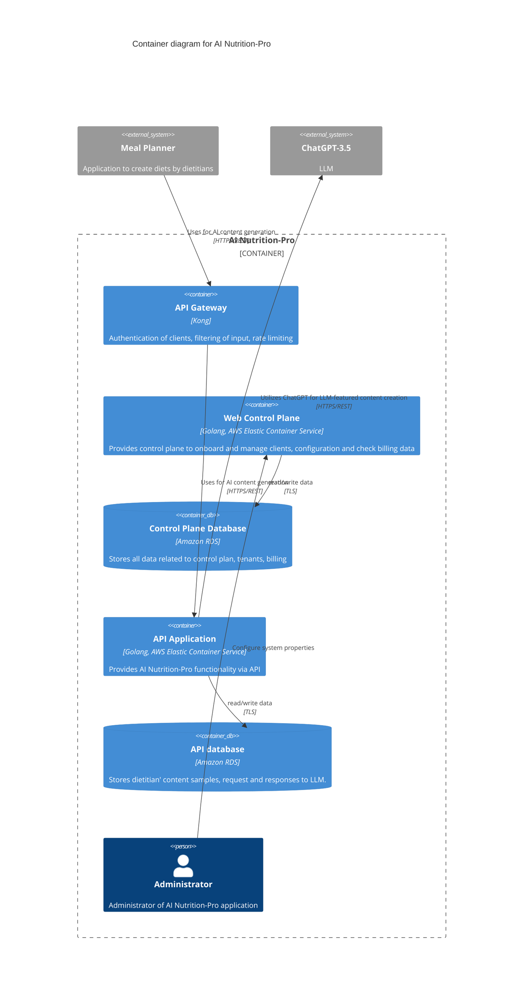

# Architecture

This document outlines the architecture of the AI Nutrition-Pro application.

## Containers Context diagram

### External systems and persons

| Name | Type | Description | Responsibilities |
| --- | --- | --- | --- |
| Meal Planner application | External system, web application | One of many Meal Planner applications that can be integrated with AI Nutrition-Pro. It connects to AI Nutrition-Pro using REST and HTTPS. | - uploads samples of dietitians' content to AI Nutrition-Pro   - fetches AI generated results, e.g. diet introduction, from AI Nutrition-Pro | 
|  ChatGPT-3.5 | External system, API | It's OpenAI product, an LLM solution | It will be used to generate content based on provided samples. |
 
### AI Nutrition-Pro container context systems and persons

| Name | Type | Description | Responsibilities |
| --- | --- | --- | --- |
| Web Control Plane | Internal system, Web application | It's written using Golang and deployed as Docker container into AWS Elastic Container Service. It uses Control Plane Database to store data. It's used in 3 roles: Administrator, App Onboarding Manager, and Meal Planner application manager. | Provide control plane to onboard and manage clients, configuration and check billing data |
| Control Plane Database | Internal database, Amazon RDS instance | Database | storing data for Web Control Plane |
| API Gateway | Internal system, API Gateway | Kong API Gateway | - authentication   - rate limiting   - filtering of input |
| API Application | Internal system, API application | It's written using Golang and deployed as Docker container into AWS Elastic Container Service | Provides AI Nutrition-Pro functionality via API. |
| API database | Internal database, Amazon RDS instance | Stored data: samples of dietitians' content, requests, and responses to LLM. | Storing data for API Application |
| Administrator | Internal Person | Administrator of AI Nutrition-Pro application. | - manage server configuration   - resolve problems   |

### Security

1. Authentication with Meal Planner applications - each has individual API key.
2. Authorization of Meal Planner applications - API Gateway has ACL rules that allow or deny certain actions.
3. Encrypted network traffic - network traffic between Meal Planner applications and API Gateway is encrypted using TLS.
