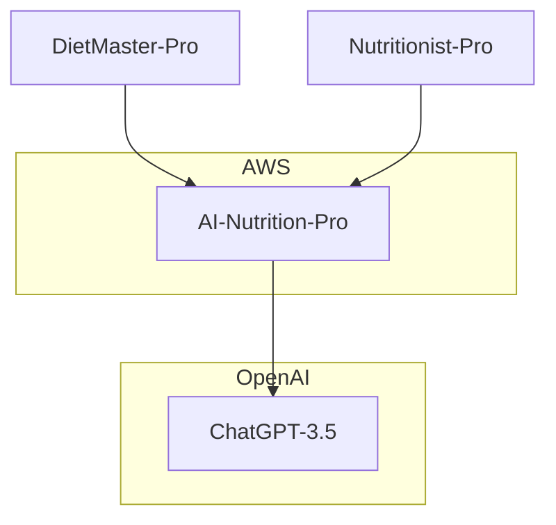

# AI Nutrition-Pro

## Business background

Dietitians use online applications to create meals, diets and calculate calories called meal planners. Different professionals have different ways of creating diets, which gives a personal style to it. LLMs can reproduce this personal style of writing based on samples of already created content. Meal planners can use LLMs to speed up diet creation for dietitians..

## Project Overview

AI Nutrition-Pro will be backend API application that will have the possibility to integrate with any meal planner application for dietitians. It will reproduce the personal style of a nutrition specialist based on samples.

Dietitians will not use the application directly but from their meal planner applications. There will be no user interface exposed to Dietitians. Integration will be using meal plan applications backend.

Direct clients of AI Nutrition-Pro will be applications like DietMaster Pro, Nutritionist Pro, or others. Those clients will send to AI Nutrition-Pro samples of content and AI Nutrition-Pro will generate requested type of content based on that. AI Nutrition-Pro will use LLM to generate requested content.

## Core Features

- multi-tenant API application - where tenant is client application like DietMaster Pro, Nutritionist Pro, or others.
- each tenant can contain many dietitians.
- each dietitian can have multiple customers.
- the application will be deployed into AWS cloud and use cloud-based services to store and process data.
- the application will store and process PII information that might contain personal health data of customers.
- ChatGPT 3.5 will be used as LLM.

## High level connection view

