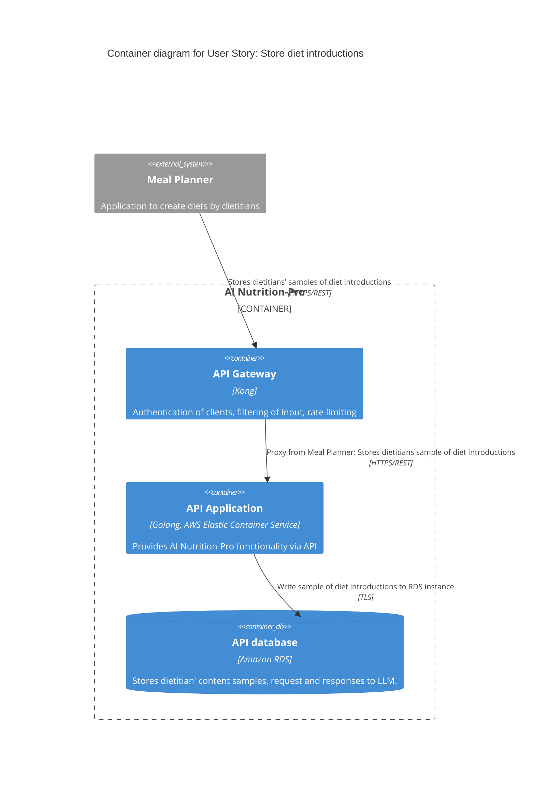

# Store diet introductions

As Meal App, I want to store samples of diet introductions of dietitians, so that those can be later used to generate new diet introductions using ChatGPT.

## Diagram



## New API

New API to implement:

```
POST /api/v1/storeContent
{
  "type": "introduction",
  "dietitian-uuid": "3beddddb-d8f2-41a3-8b6e-38bf2a39a56c",
  "client-uuid": "47dba491-8a34-4bca-934b-b32532de975b",
  "content": [
    "Hi Mark. I created this diet for you. Hope you will love it :)",
    "Hi Joanna! Hope you are well. This 3 days diet will help you get started :)"
  ]
}
```

Parameters:
- `type` - REQUIRED, string - type of content. For now only one possible value: `introduction`
- `dietitian-uuid` - REQUIRED, uuid - id of dietitian already registered in AI Nutrition-Pro
- `client-uuid` - REQUIRED, uuid - id of client application, that is Meal App, generated at onboarding
- `content` - REQUIRED, NOT-EMPTY, list of strings - list of samples to store

### Response

Positive response:
```
201 - Created
{
    "samples-uuid": "f0511554-0328-4222-a911-a57de6b7f100"
}
```

Error response:

If dietitian is not found using uuid provided in request:
```
400 - Bad request
{
    "error": "Cannot find dietitian of uuid: 3beddddb-d8f2-41a3-8b6e-38bf2a39a56c"
}
```

## Storage

Samples will be stored in API Database, which is AWS RDS instance. In table called SAMPLES.

SAMPLES table will have following columns:
- `uuid` - uuid of samples, PRIMARY KEY
- `client-uuid` - id of client application, that is Meal App, generated at onboarding, NOT EMPTY
- `type` - type of content. For now only one possible value: `introduction`, VARCHAR, NOT EMPTY
- `dietitian-uuid` - id of dietitian already registered in AI Nutrition-Pro, NOT EMPTY
- `content` - serialized JSON string, TEXT, NOT EMPTY

## Tasks

Here is detailed breakdown of this story into tasks:
- update Swagger API description file with new API
- implement API in API Application
- create new table in API Database and update IAM policy used by API Application for access control of it
- update API definition (allow new API usage) in API Gateway
